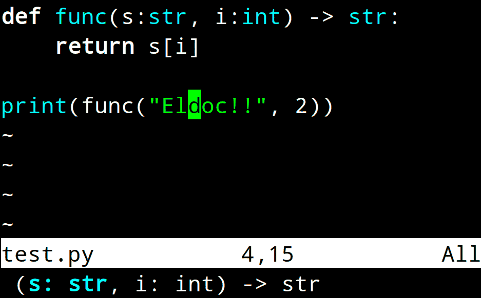

## `nvim-eldoc`: LSP-based Eldoc for Neovim

Neovim plugin that displays LSP-based function signatures at the bottom of the screen (like Emacs' eldoc) when the cursor is idle.



### Features

- Shows current function signature using LSP when the cursor is idle
- Highlight active parameter
- Colors are customizable

### Installation & configuration

With [vim-plug](https://github.com/junegunn/vim-plug):
```vimscript
Plug 'sj2tpgk/nvim-eldoc'

lua require("nvim-eldoc").setup()

set updatetime=700           " Show signature after 700ms cursor idle
hi link Eldoc    Normal      " Highlight for eldoc
hi link EldocCur Identifier  " Highlight for currently focused parameter
```

For other plugin managers, consult their documentations.
